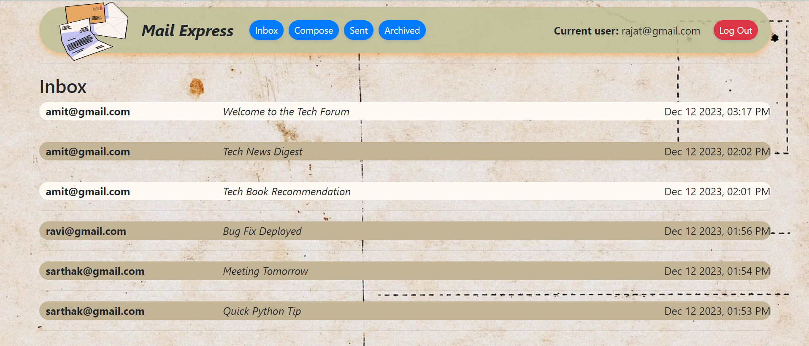
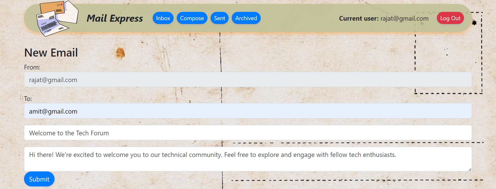
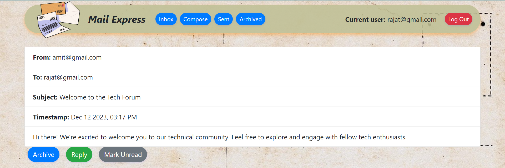
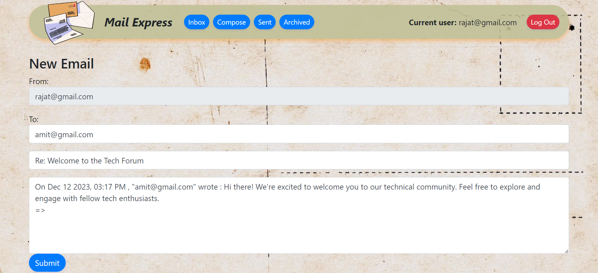

# Mail_gmail

📧🚀 **Experience a transformative email client!** This Django-powered site offers Inbox, Compose, Sent, Archive, and Admin pages. Delve into API calls for seamless email actions, elevating your web dev skills! 💻 #WebDevelopment #EmailClient

## YouTube Showcase

Dive into a realm of innovation with the CS50 Mail project! 🚀 This dynamic Django-powered website revolutionizes your email experience. Immerse yourself in an interactive email client boasting pages like Inbox, Compose, Sent, Archive, and an Admin Page. 📧💻 Explore the intricacies of making API calls to seamlessly view, send, receive, and archive emails, unlocking a world of possibilities in this exhilarating coding journey.

Solo at the helm, this project masterfully leverages two databases - one dedicated to users and the other to manage the flow of sent and received emails. The orchestration of these databases is elegantly conducted through the intuitive Admin Page. 🗃️💼

Curious to peek behind the curtain? Explore the enchanting code description on YouTube: 

  

## Screenshots

### Home Page

### Compose Email Page

### Email Reading Page

### Email Reply Page

## How to Use

To run this code, you need to install:

1. Django: `pip install Django`
2. Django-crispy-forms: `pip install django-crispy-forms`

After installation, run `python manage.py runserver` in the terminal.

## Technologies Used

- Django 🚀
- Python 🐍
- Web Development 💻

## License

This project is licensed under the MIT License - see the [LICENSE](LICENSE) file for details.
